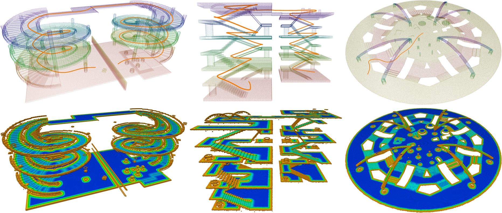

# PCT Planner

## 项目简介

本项目是论文 **Efficient Global Navigational Planning in 3-D Structures Based on Point Cloud Tomography**（已被 TMECH 接收）的实现。
项目通过对环境点云进行层析重建，为多层结构中的地面机器人提供高效、可扩展的全局导航规划框架。

**项目演示**：[pct_planner](https://byangw.github.io/projects/tmech2024/)



## 论文引用

如果本项目对你的研究有帮助，请引用以下论文：

[Efficient Global Navigational Planning in 3-D Structures Based on Point Cloud Tomography](https://ieeexplore.ieee.org/document/10531813)

```bibtex
@ARTICLE{yang2024efficient,
  author={Yang, Bowen and Cheng, Jie and Xue, Bohuan and Jiao, Jianhao and Liu, Ming},
  journal={IEEE/ASME Transactions on Mechatronics},
  title={Efficient Global Navigational Planning in 3-D Structures Based on Point Cloud Tomography},
  year={2024},
  volume={},
  number={},
  pages={1-12}
}
```

## 环境依赖

### 系统环境

- Ubuntu 20.04 或更高版本
- ROS Noetic 或更高版本，建议安装 `ros-desktop-full`
- CUDA 11.7 或更高版本（可选，仅 CUDA 层析后端需要）

### Python 依赖

- Python 3.8 或更高版本
- NumPy、SciPy（CPU 层析后端）
- Open3D
- [CuPy](https://docs.cupy.dev/en/stable/install.html) 与 CUDA 11.7 或更高版本（可选，GPU 层析后端）

## 编译安装

项目包含两个模块：

- `tomography/`：点云层析重建
- `planner/`：路径规划与轨迹优化

使用前需要编译 `planner/`。先编译第三方依赖，再编译规划器：

```bash
cd planner/
./build_thirdparty.sh
./build.sh
```

然后将本项目放入 catkin 工作空间的 `src/` 目录并编译 ROS 包：

```bash
mkdir -p ~/catkin_ws/src
ln -s /你的路径/PCT_planner ~/catkin_ws/src/pct_planner
cd ~/catkin_ws
catkin_make
source devel/setup.bash
```

ROS 包提供 `package.xml`、安装规则和可复用的 launch 文件；规划器的 GTSAM/OSQP 原生库仍由上面的脚本编译。

## 运行示例

项目提供三个场景：**Spiral**、**Building** 和 **Plaza**。

- **Spiral**：来自 [3D2M planner](https://github.com/ZJU-FAST-Lab/3D2M-planner) 的螺旋立交场景。
- **Building**：包含楼梯、斜坡、悬空结构和障碍物的多层室内场景。
- **Plaza**：用于重复轨迹生成评估的复杂室外广场场景。

### 构建场景层析图

运行规划前，需要根据点云文件构建对应场景的 tomogram：

1. 将 `rsc/pcd/pcd_files.zip` 解压到 `rsc/pcd/`。
2. Spiral 场景的点云需要从 [3D2M planner Spiral 点云目录](https://github.com/ZJU-FAST-Lab/3D2M-planner/tree/main/planner/src/read_pcd/PCDFiles) 下载。
3. 启动 ROS Master，并使用配置文件 `rsc/rviz/pct_ros.rviz` 启动 RViz。
4. 运行层析脚本：

```bash
cd tomography/scripts/
python3 tomography.py --backend auto \
  --pcd-file building2_9.pcd --tomogram-name building2_9
```

`--backend auto` 会在检测到 CuPy 和 CUDA 设备时使用 CUDA，否则自动回退到 CPU。也可以显式指定：

- `--backend cpu`：强制使用 NumPy/SciPy CPU 后端。
- `--backend cuda`：强制使用 CUDA 后端；CUDA 不可用时直接报错。

CPU 后端与 CUDA 后端生成相同布局的 tomogram pickle 文件，但处理大型点云时速度较慢。CPU 后端会使用最多 8 个线程并行执行切片膨胀。

生成的层析图会以 ROS `PointCloud2` 消息发布到 RViz，并保存到 `rsc/tomogram/`。

### 生成轨迹

层析图生成完成后，运行规划示例：

```bash
export LD_LIBRARY_PATH="$LD_LIBRARY_PATH:/你的路径/PCT_planner/planner/lib/3rdparty/gtsam-4.1.1/install/lib"
cd planner/scripts/
python3 plan.py --tomogram-name building2_9
```

规划生成的轨迹会以 ROS `Path` 消息发布到 RViz。

### 使用 launch 文件启动

启动层析节点：

```bash
roslaunch pct_planner tomography.launch backend:=cpu
```

启动规划节点：

```bash
roslaunch pct_planner planner.launch
```

也可以一键启动层析、规划和可选 RViz。规划节点会自动等待对应 tomogram 文件生成：

```bash
roslaunch pct_planner pct_planner.launch \
  backend:=cpu launch_rviz:=true
```

可用参数：

- `pcd_map_file`：输入 PCD 文件，可为绝对路径或相对 `rsc/pcd/` 的路径；默认 Building PCD。
- `tomogram_name`：输出/读取的 tomogram 文件名（不带 `.pickle`）；默认 `building2_9`。
- `backend`：`auto`、`cpu` 或 `cuda`。
- `launch_rviz`：是否同时启动 RViz，默认 `false`。
- `wait_timeout`：规划节点等待 tomogram 的最长时间，默认 300 秒。

## 回归测试

CPU 和 CUDA 后端测试位于 `tomography/scripts/`：

```bash
cd tomography/scripts/
python3 -m unittest -v test_tomogram_backends.py
```

CUDA 测试会在未安装 CuPy 或没有可用 CUDA 设备时自动跳过。

## 本地部署验证结果

在 Ubuntu 20.04、ROS Noetic 和 Python 3.8 环境中，已完成 Building 场景 CPU 端到端验证：

- GTSAM、OSQP 和规划器编译成功，Python 扩展可正常导入。
- CPU 层析回归测试全部通过。
- 成功生成 `rsc/tomogram/building2_9.pickle`。
- `/global_points`、`/tomogram` 和 `/pct_path` ROS 话题正常发布。
- `/pct_path` 成功发布 1135 个有效轨迹点。
- RViz 中点云、层析图和规划路径均可正常显示。

由于测试主机未配置可用的 NVIDIA 驱动、CUDA 和 CuPy，GPU 后端未纳入本次验收。

## 许可证

源代码遵循 [GPLv2](http://www.gnu.org/licenses/) 许可证发布。

如需商业使用，请联系 Bowen Yang：[byangar@connect.ust.hk](mailto:byangar@connect.ust.hk)。
